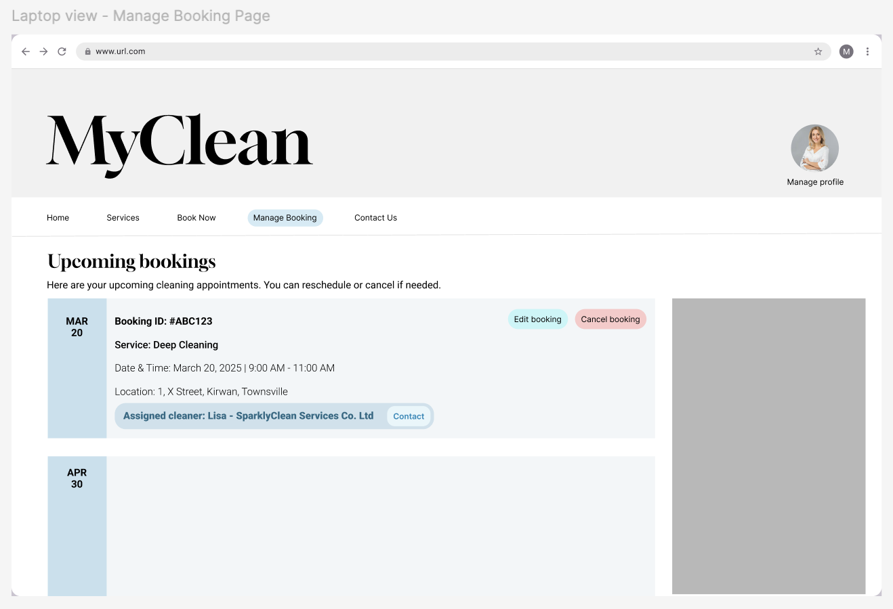
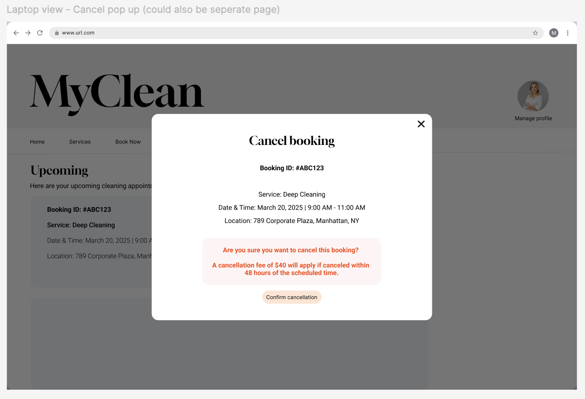
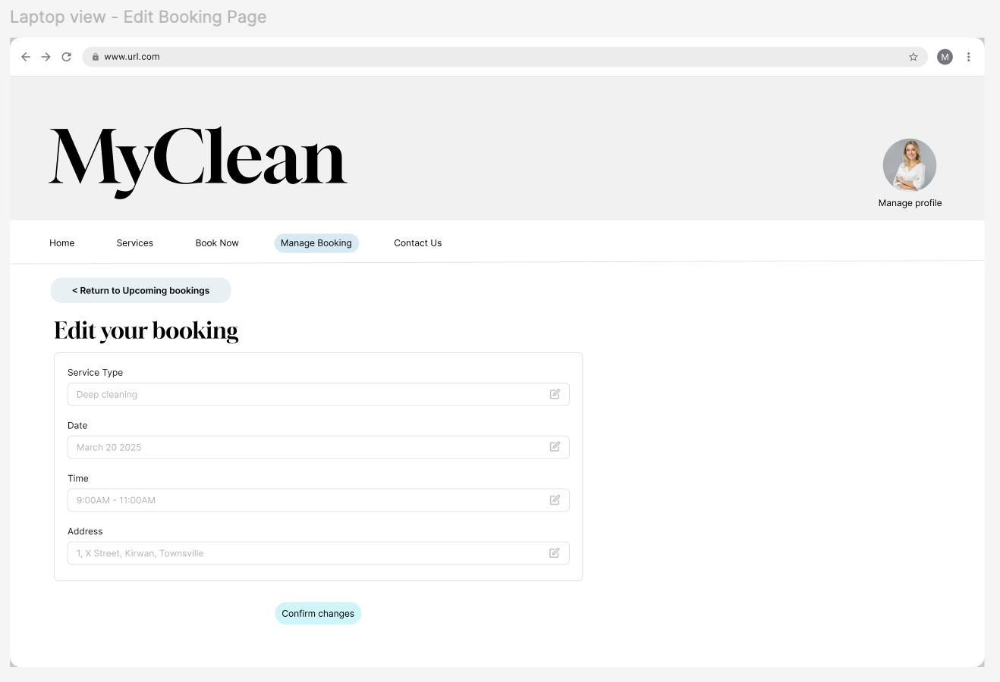
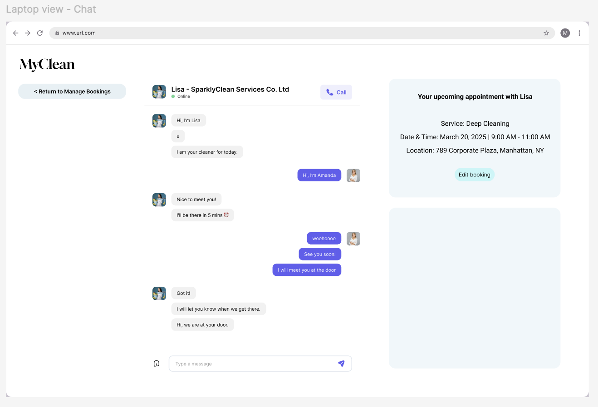

# Design

## Architectural Design 
! [UML Diagram](../Images/UML-data-diagram.png)
We decided to design the system using three main classes based on the core entities 
of the platform: User, Service Provider, and Booking. These correspond to three separate 
database tables that handle different aspects of the application logic. For the User class, 
the email field serves as the primary key, as it is unique to each user and allows easy identification 
and management. This class includes attributes such as name, isCleaner, and profileImage, allowing the 
system to distinguish between regular users and cleaners, and store relevant user data. In the ServiceProvider class, 
the name field acts as the primary key, assuming that service provider names are unique identifiers for each business.
Other fields such as location, serviceType, price, and logo support the display and filtering of services offered by 
different cleaning companies. Service providers can list services using the listServices() method. 

The Booking class represents the connection between users and service providers. A unique booking ID (implied from the diagram)
would serve as the primary key, since a single user can have multiple bookings. The foreign keys in this class are:
- The email from the User class, linking the booking back to the user who created it.
- The service provider name from the ServiceProvider class, indicating which provider is responsible for fulfilling the booking.

Each booking also stores date, status, and paymentStatus to track its progress. The confirmBooking() method allows the booking to
be updated once payment is made or a provider confirms the service. This class-based structure reflects clean separation of 
concerns while maintaining strong relationships between users, providers, and their bookings. It supports scalability, 
allowing new features like cleaner availability or customer reviews to be added in the future. 

## Database Design 
! [User Registration UI](../Images/data-flow-diagram.png)
We decided to use three databases: one for users, one for service providers, and one
for bookings. For the user database, the email will serve as the primary key as it is
unique and makes it easy to track each user. In the service provider database, the
service provider name will be the primary key as that is what differentiates each
cleaning company. In the booking database the primary key will be a unique booking ID
as one user could have multiple bookings. The user email however will be the foreign
key that connects back to the user database. 

## Interface Design 

###  Iteration 1

! [User Registration UI prototype](../Images/login_ui_1.png)
The login page was designed with a blue, grey and white colour scheme, accompanied by
an image with similar colours. The input fields are in proximity with each-other to
make it very easy to sign-up or sign-in. The design follows the standards and conventions
of most sign-in/sign-up pages. The fields change depending if the user has an account or
not by clicking on the link at the bottom. Everything else on the page remains to maintain
consistency.

! [Search page prototype](../Images/search_ui_1.png)
The search page was designed to have very simple functionality with easy to use filters
and a clean display. The search bar is situated at the top and immediately draws the eye
so the user can very quickly find what they want. Filters help users narrow their 
search down even more easily, giving them more control and customisation. 

! []

### Iteration 2

The Manage Booking page follows our blue, white, and grey color palette. A central tab bar at the top provides access 
to this section. Bookings are listed in ascending order by date, ensuring that the closest appointments appear first.
Each booking detail features a panel on the left displaying the date, allowing users to quickly identify their bookings,
as they typically refer to them by date rather than ID.
There are three clickable buttons within each booking, each with a distinct color:
- Edit Booking
- Cancel (highlighted in red)
- Contact, which is linked to the cleaner or provider’s information, making it clear that this button is used to reach them.

The Cancel Booking feature is a simple pop-up interface within the Manage Booking page. It displays the booking details 
along with a prominent red warning message that includes the $40 cancellation fee, ensuring users do not overlook this 
crucial information. The Confirm button is also highlighted in red for clarity.

The Edit Booking feature includes four clickable fields, allowing users to modify each aspect of their 
booking individually: Service Type, Date, Time, and Address—each clearly labeled. A Confirm Changes button in blue 
ensures users can finalize their updates. Additionally, a Return to Manage Booking button provides a quick way to 
navigate back to the previous page.

From the Manage Booking screen, users can tap Contact to message or call their assigned cleaner or provider 
for their appointment. The Chat page features a familiar UI, displaying the cleaner’s name in bold along with their 
profile picture. A call button is placed next to their name for users who prefer calling. On the right side of the chat 
box, a booking information card provides a quick overview of the appointment details. Additionally, an Edit Booking 
button is available, allowing users to make changes directly from this page without needing to navigate back.
Additionally, a return to Manage booking is also provided to navigate back to the previous page.