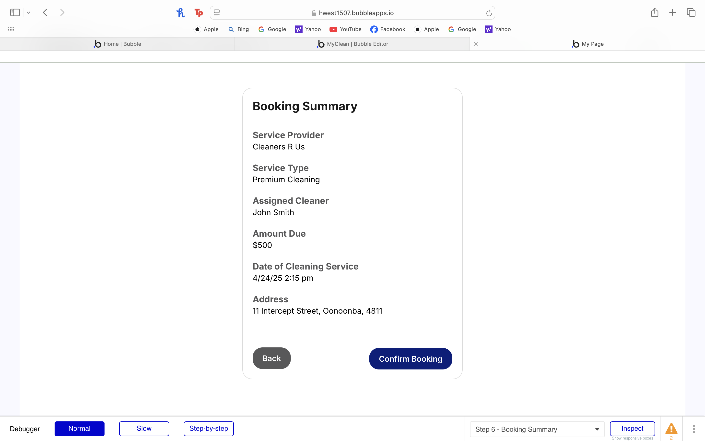
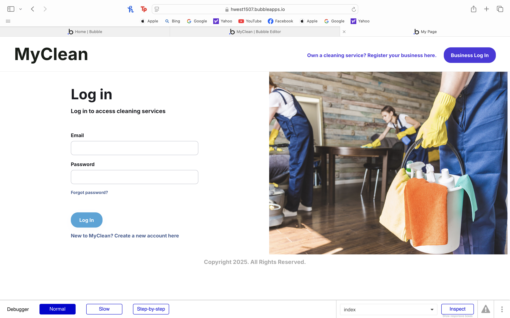

# Design

## Architectural Design 

! [UML Diagram](../Images/00_Diagrams/UML-data-diagram.png)
We designed the system architecture around five main classes: **User**, **ServiceProvider**, **ServiceType**, **Booking**, and **Review**. These classes map directly to distinct database tables, reflecting the primary functional components of the platform and supporting clean modularization.

---

## User Class

The `User` class stores information about all platform users, including regular customers, businesses, and cleaners. 
The **email** field serves as the primary key, given its uniqueness and reliability for identity and login.

**Attributes:**
- `email`: String (Primary Key)
- `name`: String
- `isCleaner`: Boolean
- `isBusinessAccount`: Boolean
- `profileImage`: Image
- `serviceProvider`: String (Optional FK to `ServiceProvider`)
- `socialAccounts`: String

This structure supports role-based logic (e.g., cleaner vs. customer) and smooth user management.

---

## ServiceProvider Class

The `ServiceProvider` class represents registered cleaning businesses. The **serviceName** acts as the primary key,
assuming business names are unique.

**Attributes:**
- `serviceName`: String (Primary Key)
- `adminEmail`: String (FK to `User`)
- `location`: String
- `basePrice`: Number
- `isEcoFriendly`: Boolean
- `logo`: Image

Service providers list offerings through the associated `ServiceType` class.

---

## ServiceType Class

The `ServiceType` class holds information about the various services a provider offers. The **serviceTypeName** serves 
as the primary key, and `serviceProvider` acts as a foreign key.

**Attributes:**
- `serviceTypeName`: String (Primary Key)
- `serviceDescription`: String
- `serviceDuration`: String
- `servicePrice`: Number
- `serviceProvider`: String (FK to `ServiceProvider`)

This structure enables each provider to offer multiple services with customized details.

---

## Booking Class

The `Booking` class captures the interaction between users and service providers. A unique **booking ID** serves as 
the primary key (implied).

**Attributes:**
- `address`: String
- `assignedCleaner`: String (FK to `User` where `isCleaner = true`)
- `date`: Date
- `status`: String
- `serviceType`: String (FK to `ServiceType`)
- `serviceProvider`: String (FK to `ServiceProvider`)
- `userEmail`: String (FK to `User`)

This allows for full tracking and lifecycle management of each booking. The `confirmBooking()` method represents 
transitions in the booking process, such as confirmation or completion.

---

## Review Class

The `Review` class supports user feedback.

**Attributes:**
- `comment`: String
- `rating`: Number
- `date`: Date
- `userEmail`: String (FK to `User`)
- `serviceProvider`: String (FK to `ServiceProvider`)

This enables users to rate services, improving transparency and quality control.

## Database Design 

We decided to use three databases: one for users, one for service providers, and one
for bookings. For the user database, the email will serve as the primary key as it is
unique and makes it easy to track each user. In the service provider database, the
service provider name will be the primary key as that is what differentiates each
cleaning company. In the booking database the primary key will be a unique booking ID
as one user could have multiple bookings. The user email however will be the foreign
key that connects back to the user database. 

## Interface Design 

###  Iteration 1

#### Create Bookings

##### Prototype

In our prototype, the booking process is divided across multiple pages to prevent users from feeling overwhelmed by too 
many fields at once. Each page features a clean and clear layout, making it easy to follow and fill out. A monochrome 
color scheme was used to maintain a minimal and focused design.

##### Implementation (Iteration 2)

In our current implementation for Iteration 2, color has been introduced to key buttons to make them more distinct and 
improve visibility. The overall flow of the booking pages remains consistent with our prototype, with a few minor 
adjustments to enhance user experience, such as moving the cleaner selection step earlier in the process. These changes 
were made based on feedback from team members and aim to streamline the booking journey while maintaining familiarity 
with the original design.

#### Track Schedules

##### Prototype

The Tracking Schedules section is part of our Manage/Edit Booking page, which is discussed in more detail later. 
This screen displays bookings in a sorted list, with the closest upcoming bookings shown first. In future iterations,
we are considering introducing a calendar-based UI, depending on client feedback and user needs.

##### Implementation (Iteration 2)

Our implemented UI closely follows the layout and design of our prototype.

#### Manage Payments

##### Prototype

Payment is done in our new booking process, which we go in detail later. In our prototype, the user has the option of 
selecting from a range of supported payment methods, and can enter their card in manually if they desire. 

##### Implementation (Iteration 2)

In Iteration 2, the payment page is currently a placeholder and not functional. In future iterations, we plan to 
integrate a button that redirects users to Stripe’s secure payment page. This integration will handle the entire 
payment process, including authorization and sending receipts via email.

#### Create Profiles

##### Prototype

The login page was designed with a blue, grey and white colour scheme, accompanied by
an image with similar colours. The input fields are in proximity with each-other to
make it very easy to sign-up or sign-in. The design follows the standards and conventions
of most sign-in/sign-up pages. The fields change depending if the user has an account or
not by clicking on the link at the bottom. Everything else on the page remains to maintain
consistency.

##### Implementation (Iteration 2)

The sign-up and log-in pages follow our prototype, with slight adjustments in the color scheme, including a blue hue 
for the main sign-up and log-in buttons. In the top-right corner, a new section has been added for business admins, 
allowing them to register or log in to their admin accounts. This section is highlighted in purple, aligning with the 
color scheme used for the admin page.

#### Search 

##### Prototype

The search page was designed to have very simple functionality with easy to use filters
and a clean display. The search bar is situated at the top and immediately draws the eye
so the user can very quickly find what they want. Filters help users narrow their 
search down even more easily, giving them more control and customisation. 

##### Implementation (Iteration 2)

Our implemented UI closely follows the layout of our prototype. In Version 2, the interface was updated with rounded 
elements to enhance visual appeal and improve user-friendliness.

### Iteration 2

#### Manage Booking

##### Prototype

The Manage Booking page follows our blue, white, and grey color palette. A central tab bar at the top provides access 
to this section. Bookings are listed in ascending order by date, ensuring that the closest appointments appear first.
Each booking detail features a panel on the left displaying the date, allowing users to quickly identify their bookings,
as they typically refer to them by date rather than ID.
There are three clickable buttons within each booking, each with a distinct color:
- Edit Booking
- Cancel (highlighted in red)
- Contact, which is linked to the cleaner or provider’s information, making it clear that this button is used to reach them.

##### Implementation (Iteration 2)

The implemented UI for the Manage booking view closely follows our prototype.

#### Cancel Booking

##### Prototype

The Cancel Booking feature is a simple pop-up interface within the Manage Booking page. It displays the booking details 
along with a prominent red warning message that includes the $40 cancellation fee, ensuring users do not overlook this 
crucial information. The Confirm button is also highlighted in red for clarity.

##### Implementation (Iteration 2)

The implemented UI for the Cancel Booking pop-up closely follows our prototype.

#### Edit Booking

##### Prototype

The Edit Booking feature includes four clickable fields, allowing users to modify each aspect of their 
booking individually: Service Type, Date, Time, and Address—each clearly labeled. A Confirm Changes button in blue 
ensures users can finalize their updates. Additionally, a Return to Manage Booking button provides a quick way to 
navigate back to the previous page.

##### Implementation (Iteration 2)

Our implemented UI differs slightly from the prototype, as we reused assets from the Make a New Booking screens to save 
time and resources. This approach also made sense from a design perspective, as it maintains consistency and leverages 
elements users are already familiar with.

#### Messaging 

##### Prototype

From the Manage Booking screen, users can tap Contact to message or call their assigned cleaner or provider 
for their appointment. The Chat page features a familiar UI, displaying the cleaner’s name in bold along with their 
profile picture. A call button is placed next to their name for users who prefer calling. On the right side of the chat 
box, a booking information card provides a quick overview of the appointment details. Additionally, an Edit Booking 
button is available, allowing users to make changes directly from this page without needing to navigate back.
Additionally, a return to Manage booking is also provided to navigate back to the previous page.

The Chat feature, being a lower-priority user story, was deferred to the next iteration and does not have a implemented
UI yet. 

#### Reviews

The Reviews feature did not have a prototype UI; instead, it was designed and implemented directly in the current 
iteration based on team discussions and design guidelines

##### Implementation (Iteration 2)

The option to review service providers is conveniently located on the screen where users select a provider. Button to 
view all existing reviews are also displayed here. Each service provider has a rating out of 5, calculated as the 
average of all their submitted reviews.

Submitting a review is done through a pop-up that features an interactive star rating system, allowing users to click 
and select their rating. Half-star ratings are supported for greater precision. Users can also include a text comment 
to share more about their experience.

The All Reviews page displays only the reviews associated with a specific service provider. Each review shows the name
of the user who submitted it, along with their profile picture if available.

#### Eco-friendly

The Eco-Friendly feature did not have a prototype UI; instead, it was designed and implemented directly in the current 
iteration based on team discussions and design guidelines.

##### Implementation (Iteration 2)

An eco-friendly icon was added to service providers as a visual indicator. The green icon is displayed above the 
provider’s name.

#### Admin Dashboard

The Admin Dashboard did not have a prototype UI; instead, it was designed and implemented directly in the current 
iteration based on team discussions and design guidelines.

##### Implementation (Iteration 2)

To visually distinguish the admin interface from regular user accounts, a purple and black color scheme was used. 
This choice gives the admin UI a bolder and more professional appearance.

As part of the onboarding process, the business admin is guided through a 5-step setup where they enter their business
details and provide the necessary information to get started. Each button in the process is large and clearly labeled. 
To ensure the correct flow and prevent steps from being skipped, only one button is active (and highlighted) at a time.

Each button opens a pop-up where the admin can enter all the required details for that step.

This is the main dashboard for admins, featuring a visual indicator that clearly marks it as the admin view, along with 
the business name displayed at the top. The header tab provides access to all the pages available on the admin site. 
On the left, admins can view currently active services and the names of assigned cleaners, with the option to delete 
each row directly. On the right side of the page, there are buttons to add a new service or a new cleaner. In 
Iteration 2, if admins wish to make changes to an existing service or cleaner, they must delete the row and add a new 
entry. In future iterations, we plan to implement an Edit functionality for more flexibility.

