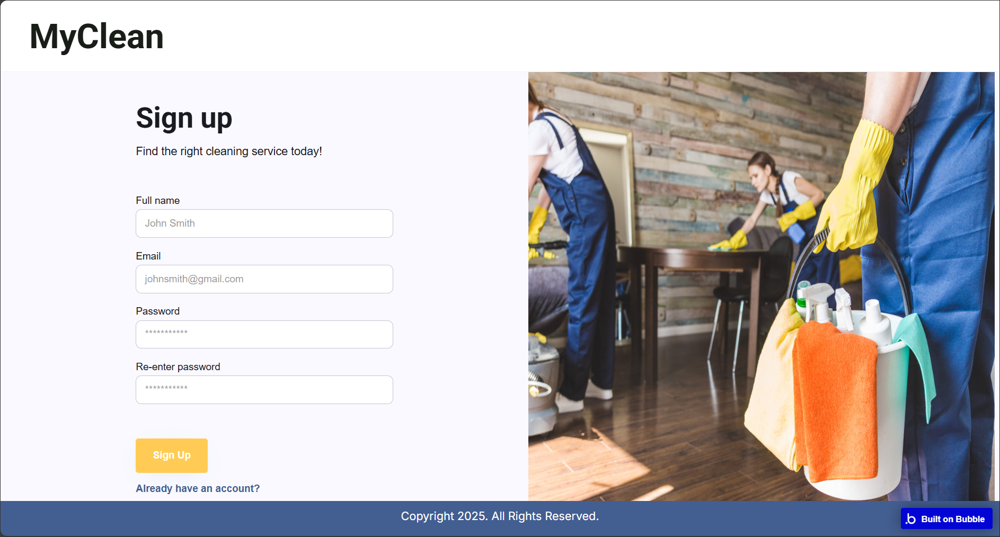
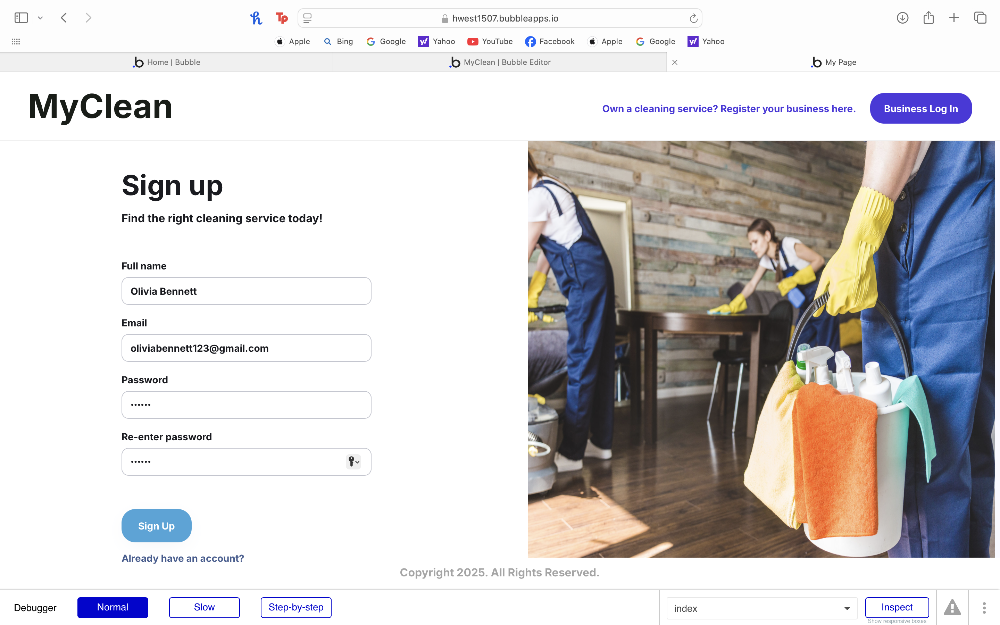
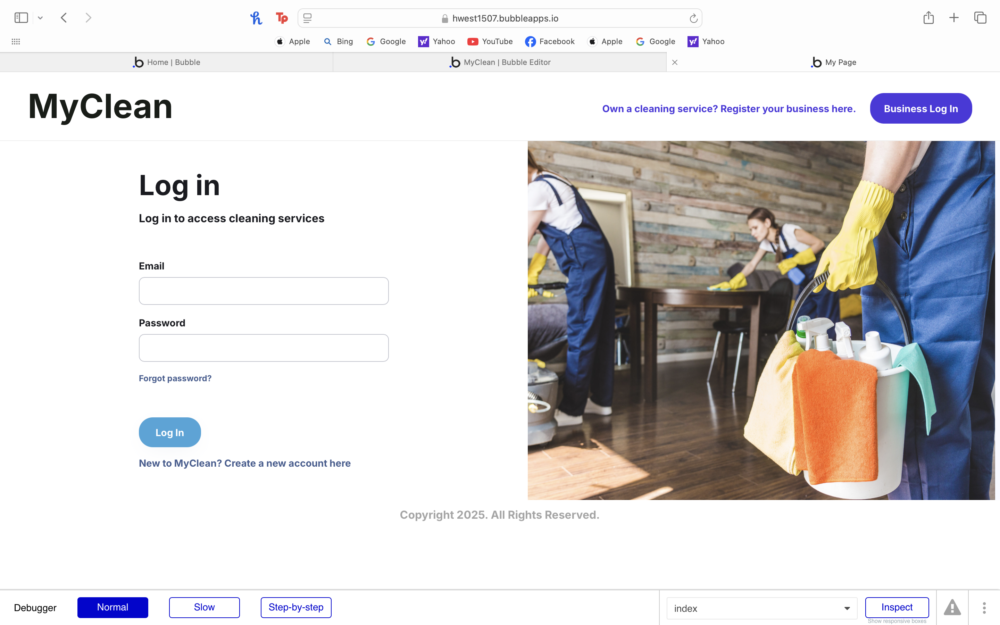
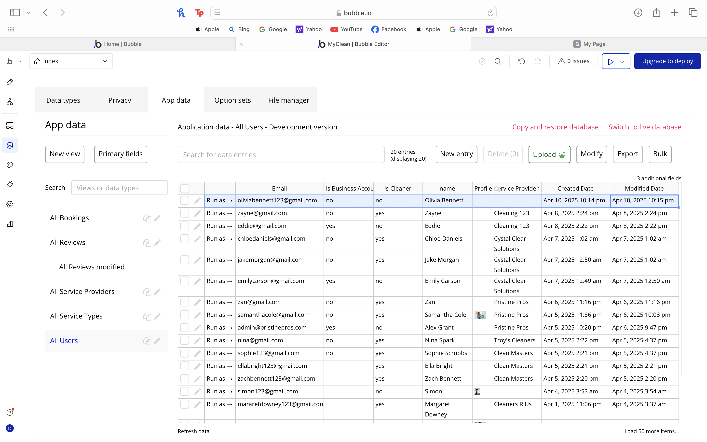
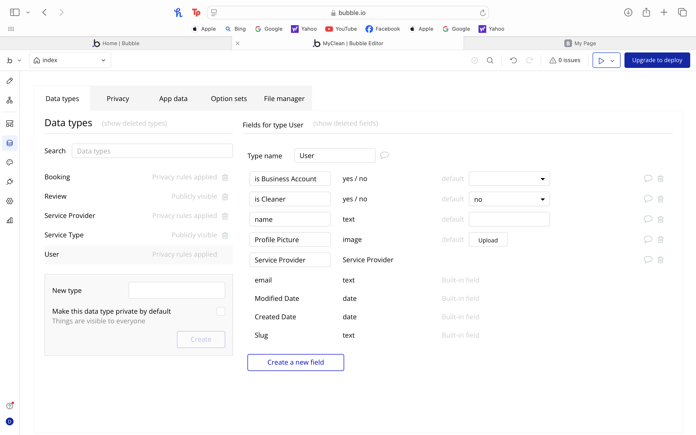
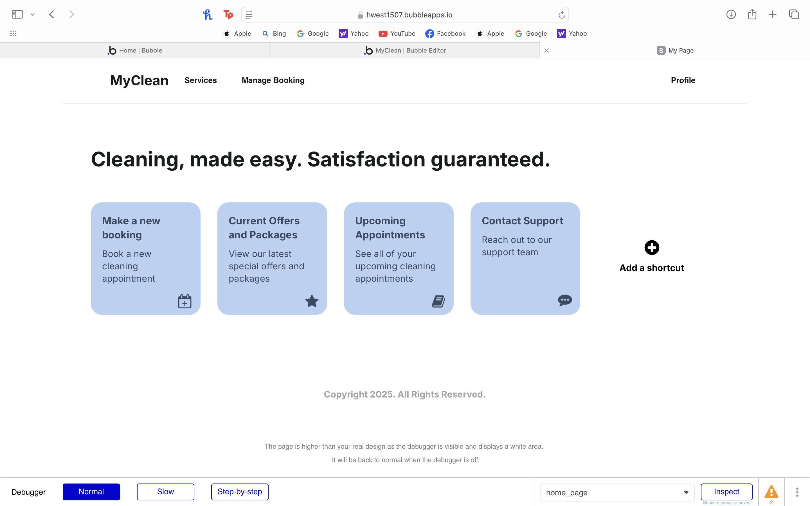

# User story title: e.g. Show current deals

Keep any other version here as well, e.g. Display current deals, Let user to click on "show-current-deals".

## Priority: 20

## Estimation: 1 day

1. Liam Whiting - 1 day
2. Hayden West - 1 day
3. Danny Zaw - 1.5 days
4. Salvin George - 1 day

## Assumptions (if any):

## Description: Enable providers to update business details, services, and availability.

* Description-v1: Enable providers to update business details, services, and availability.

## Tasks, see chapter 4.

1. Create login/sign-up page UI, estimation 1 hour
2. Create database for users and connect to login/sign-up page, estimation 1 day
3. Add data validation and error checking, estimation 2 hours

# UI Design:
  
[View design explanation](design_explanation.md)

# Completed:
The login/sign-up page was completed and then developer testing was performed.
This was the initial design of the sign-up page in bubble:  

# Testing

## Developer Testing:
While testing we entered multiple fake profiles and then checked the database to ensure the profiles were saved.  
A test account was signed up by filling out each input field.  
  
The login page was also tested with existing accounts.  
  
The new user entry was correctly added to the user database after signing up.  
  
Here is the structure of the user database:  
  
After signing up the user is then taken to the home page so that they can easily
view the functionality of the website (e.g. making a booking, upcoming appointments, etc.)  
 

## User Testing:
Upon accessing the create profile screen our user was easily able to enter their details and create their profile.
