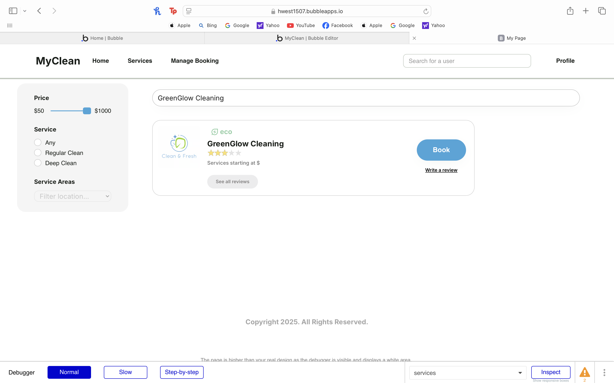

# Search Cleaning Companies

## Priority: 20
While searching is an important feature it is not critical to the functionality of the website.

## Estimation: 1 day
Any notes on estimation go here. Keep your planning poker game numbers. For example
1. Liam Whiting - 1 day
2. Hayden West - 0.5 days
3. Danny Zaw - 1 day
4. Salvin George - 1 day 

## Assumptions (if any):

## Description: 

Description-v1: Allow users to search by name for a cleaning company

## Tasks, see chapter 4.

1. Create UI, Estimation 1 hour
2. Implement search functionality, Estimation 2 hours
3. Implement filter functionality, Estimation 3 hours
4. Implement error handling and validation, Estimation 1 hour

# UI Design:
See prototype image and link to design explanation below:   
[Search page prototype](../Images/01_Prototypes/search_ui_1.png)  
[View design explanation](design_explanation.md)  

# Completed:
The search page was completed and then developer testing was performed.

# Testing

## Developer Testing:
To test the search function multiple cleaning companies were added with different details then we 
tested each filter and the search bar ensuring only the expected cleaning companies showed up.
The search bar can be used to search for a specific company or a specific keyword.  
  

The filters can be used to help narrow down the search, and the testing showed that the
filters work correctly.

## User Testing:
The user was able to easily search for different cleaning companies using the search bar
and filters.
[Search Bar](../Images/02_Implemented/05_Search/01_search_provider.png) 

