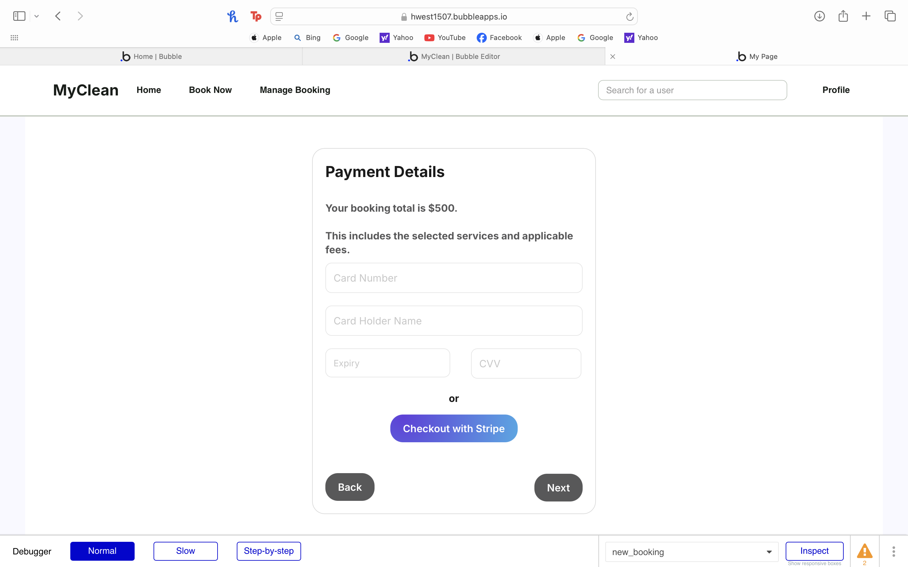

# Invoice Generation.

## Priority: 20
    While invoices are useful full users to have they are not crtical for the website and are therfore a
    lower priority

## Estimation: 2 days
Any notes on estimation go here. Keep your planning poker game numbers. For example
1. Liam Whiting - 2 days
2. Hayden West - 2 days
3. Danny Zaw - 1 day
4. Salvin George - 2 day

## Assumptions (if any):

## Description: Create an online receipt as proof of booking and payment.

Description-v1: Create an online receipt as proof of booking and payment.

## Tasks, see chapter 4.

1. Implement backend invoice generation logic, Estimation 1 days
2. Generate invoices in PDF format, Estimation 1 hour
3. Store and retrieve invoices, Estimation 1 hour
4. Create UI, Estimation 1 hour
5. Email invoice to users, Estimation 1 hour

# UI Design:

# Completed:
Testing will be implemented in further iterations as stripe covers the transaction.

