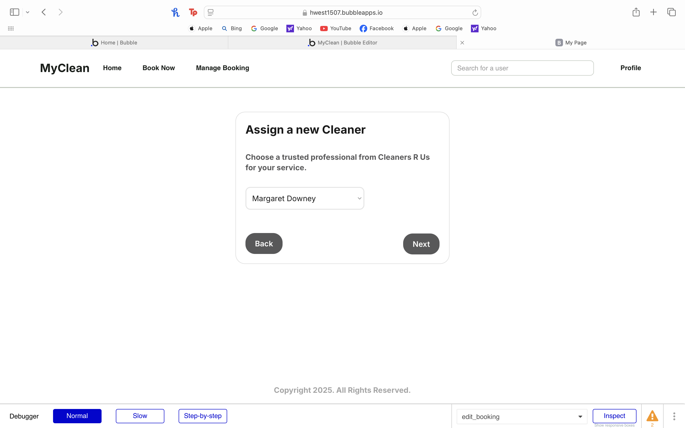
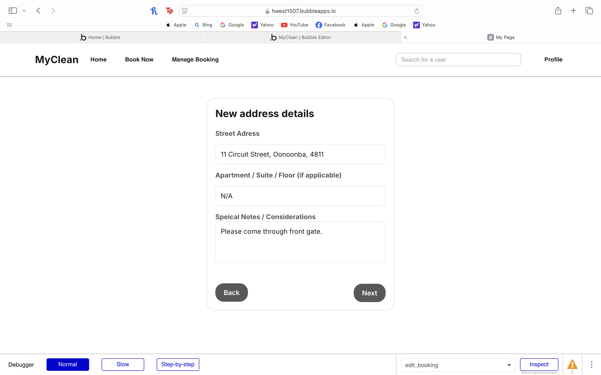
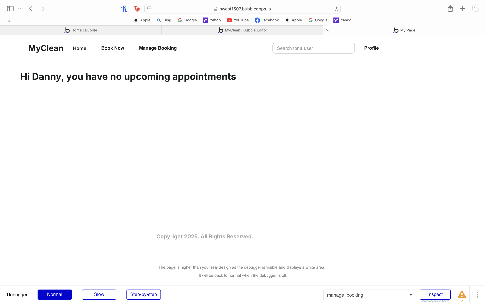

# User story title: Edit/Delete Bookings

* Edit/Delete Bookings

## Priority: 20
    While being able to edit or remove bookings is an important feature it is not 
    critical for the website to function therefore makeing it a lower priority

## Estimation: 1 day

1. Liam Whiting -  1 day
2. Hayden West - 1.5 days
3. Danny Zaw - 2 days
4. Salvin George - 1 day

## Assumptions (if any):

## Description:

Description-v1: Allow the user to edit or delete their booking details

## Tasks, see chapter 4.

1. Create UI, Estimation 1 hour
2. Implement access control, Estimation 1 hour
3. Update booking data in database, Estimation 1 hour
4. Include validation, Estimation 1 hour

# UI Design:
* (New, not in the textbook) 
* Many user stories are connected to a User interface.
* Insert a mockup design screenshot using any prototyping tools, e.g. [https://ninjamock.com/](https://ninjamock.com/)

# Completed:
* (New, not in the textbook) 
* Insert screenshots of completed. 
* If you have multiple versions (changes between iteractions), show them all.

# Testing:

## Developer Testing: 

We tested the Manage Booking page to ensure all key features function as expected. This includes testing  
cancel and edit booking actions under various conditions (e.g., valid and invalid inputs). For example, a user cannot 
press next unless all required fields are filled out. 

All workflows, backend logic, data validation, and form submissions were tested for reliability.

## User Testing:

When a user navigates to the Manage Booking page without any scheduled bookings, they will see a message saying 
"You have no upcoming bookings." This screen is dynamic and the message will automatically update once a booking is 
made. The user's name is also displayed, creating a friendly and personalized interface while also confirming that they 
are logged into the correct account.

Each booking panel displays key information about the booking. Editable details are highlighted in blue, serving as a 
subtle visual cue that these fields can be modified. When the user selects "Edit Booking," they are taken to a familiar
interface similar to the one used when the booking was originally made, with only minor adjustments. At this stage in 
Iteration 2, users have full flexibility to modify their bookings as needed. In future iterations, we plan to introduce 
a restriction that prevents edits within a certain timeframe prior to the booking date.

First, the user selects a new cleaner from the same service provider they originally booked with.

Next, the user is taken to a screen where they can choose a new date and time for their booking. In the current 
iteration, they have complete flexibility in selecting any new date. Ideally, in future updates, we plan to introduce 
a restriction that allows users to reschedule only within approximately one week of the original booking date.

The user is then taken to the address screen, where they can enter a new address for the booking.

The summary page displays all the current changes made by the user. Custom states are used to temporarily store this 
data, ensuring that no updates are written to the database at this stage.

The database is only updated after the user clicks "Confirm Changes." 

Once the booking has been edited, we can confirm that the changes have been applied to the original booking. These 
updates are automatically reflected on the Manage Booking page and are also visible in the updated database.

