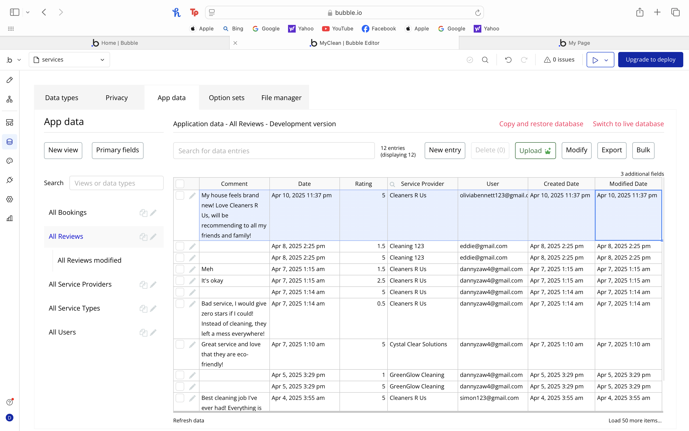
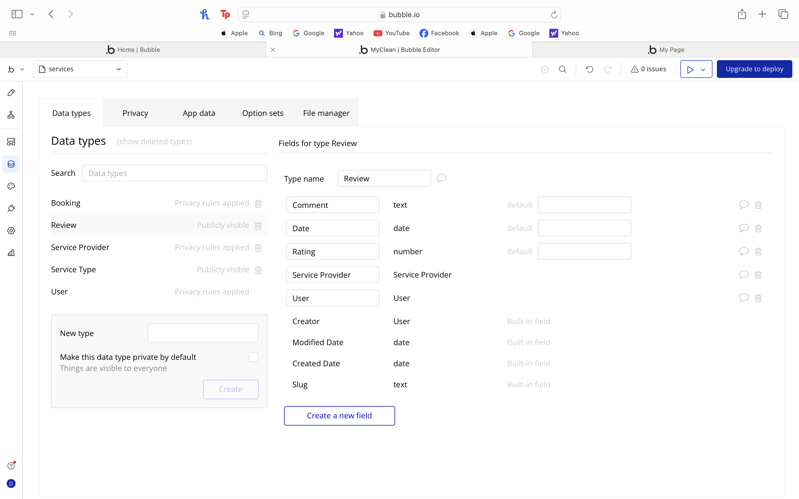
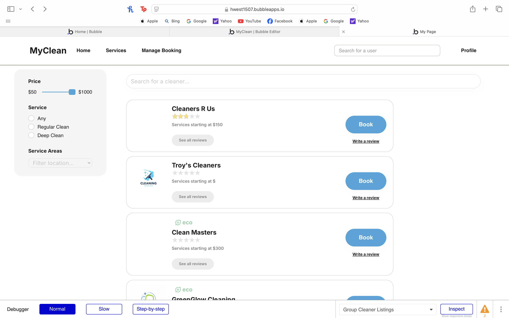
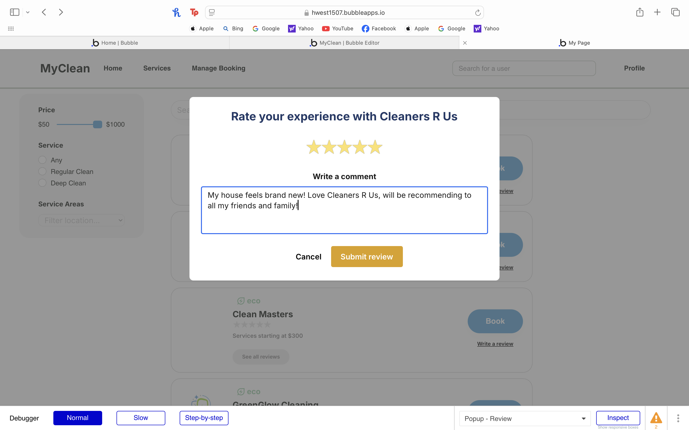
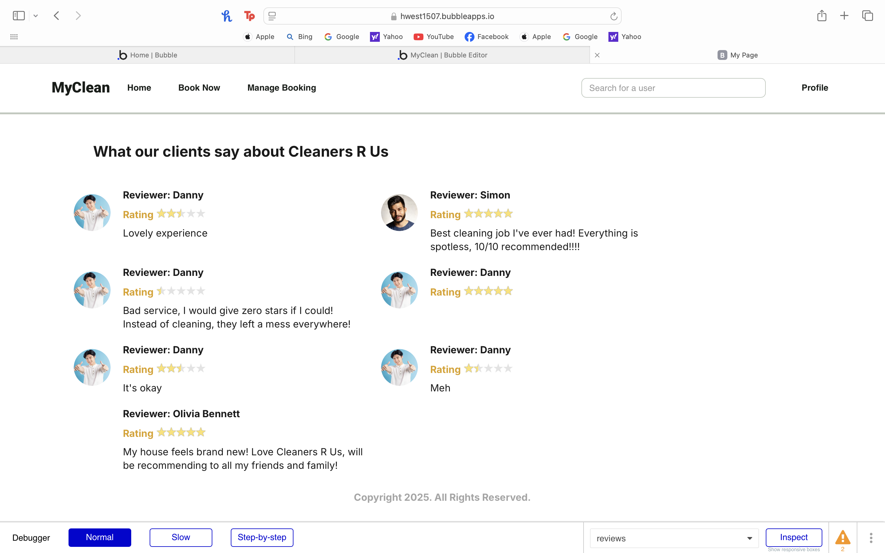

# User story title: Reviews and Ratings

## Priority: 40

## Estimation: 1 day

1. Liam Whiting -  1 day
2. Hayden West - 1 day
3. Danny Zaw - 
4. Salvin George - 1 day

## Assumptions (if any):

## Description: Allow Users to review cleaning services

Description-v1: Allow Users to review cleaning services

## Tasks, see chapter 4.

1. Create Review Database, Estimation 0.5 days
2. Develop UI allowing user to see reviews, Estimation 1 hour
3. Develop UI allowing user to make reviews, Estimation 1 hour

# UI Design:
* (New, not in the textbook) 
* Many user stories are connected to a User interface.
* Insert a mockup design screenshot using any prototyping tools, e.g. [https://ninjamock.com/](https://ninjamock.com/)

# Completed:
The search page was completed and then developer testing was performed.

## Developer testing
The review is added to the reviews database with all the correct details.  
   
The structure of the reviews database can also be seen:  
 

## User Testing
Users can review a company of their choice on the search page.  
  
The user can write a message and give a star review for the company.  
  
The average star rating of a company will be displayed when trying to book that company.
The user can also view all of the reviews for a company.   
  

