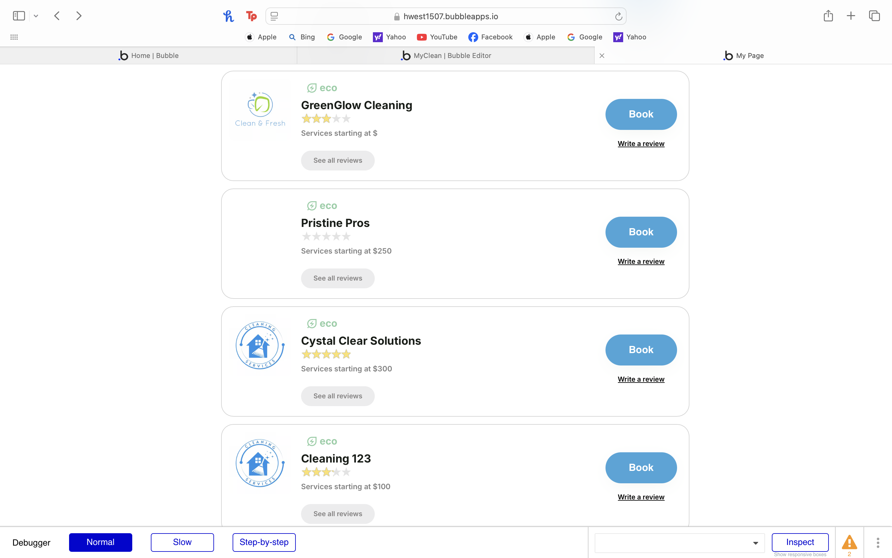

# User story title: Eco-friendly options

## Priority: 40 

Eco-Friendly options are an additional feature that are not needed for the program to function.

## Estimation: 1 day 

1. Liam Whiting -  6 hours
2. Hayden West - 1 day 
3. Danny Zaw - 1 day
4. Salvin George - 1 day

## Assumptions (if any):

## Description: Allow the user to filter companies by eco-friendly options

Description-v1: Allow the user to filter companies by eco-friendly options

## Tasks, see chapter 4.

1. Add filter UI, Estimation 1 hour
2. Add functionality to filter, Estimation 2 hours
3. Allow cleaners to select eco-friendly options, Estimation 2 hour

# Completed:
 

## Developer Testing
Eco friendly column was added in the service provider database. When browsing cleaning services
the user can see the eco-friendly tag above cleaning companies who are eco-friendly.  
  

