# User story title: Admin Dashboard

## Priority: 10
Essential component to the website. Allows cleaning companies to register their business
to MyClean and list their services to customers.

## Estimation: 2 days

1. Liam Whiting -  1.5 days
2. Hayden West - 1 day
3. Danny Zaw - 2 days
4. Salvin George - 3 days

## Assumptions (if any):

## Description:

Description-v1: Cleaning companies can register as a business account on MyClean, gaining access to the admin panel. 
During registration, admins will go through a quick onboarding process to set up their business and add their first 
service and cleaner. Once completed, the dashboard will serve as the hub for managing their business, including adding 
or removing services.

## Tasks, see chapter 4.

1. Design UI layout, Estimation 1 day
2. User validation, Estimation 3 hours
3. Implement role-based access control, Estimation 3 hours
4. Write to and store data in database, Estimation 3 hours

# UI Design:
User story was added during the iteration as we realised how important it was.
No prototypes.

# Completed:

## Developer Testing
The admin dashboard was tested to ensure all the data is handled and displayed properly.
Adding new service providers correctly stored the data where it should be. The admins could add
their own cleaners and service types.
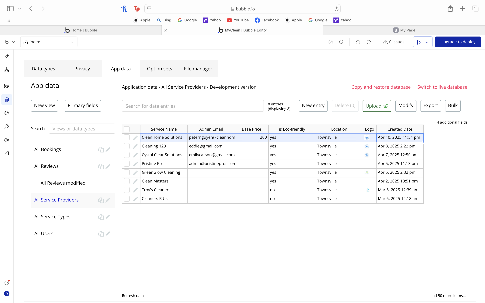
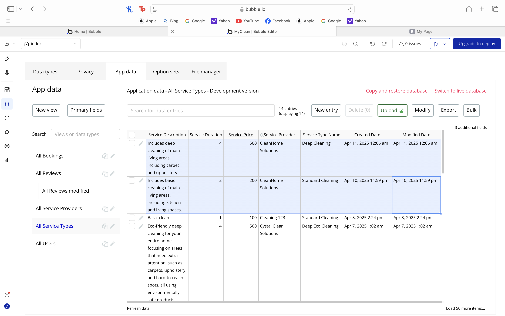
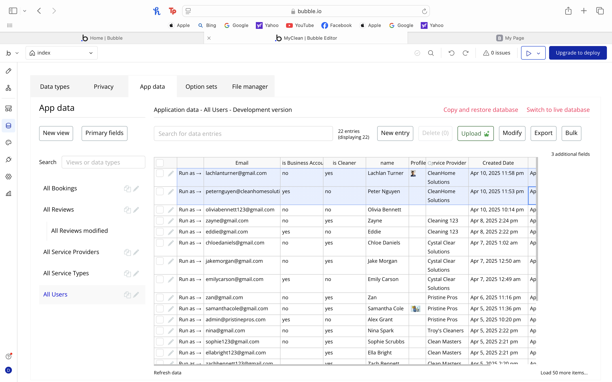

## User Testing
When a service provider want to add their business to the website, they must register
the company through an admin login. This creates a special user account that can add
a cleaning company.  
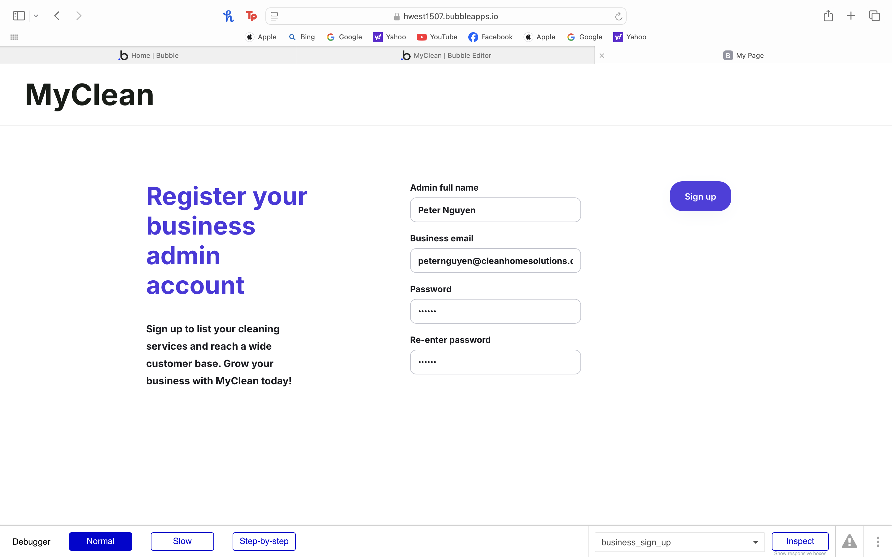  
After signing up, the admin can add their cleaning company.  
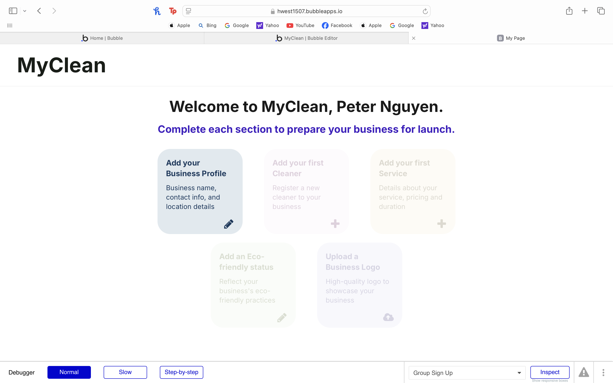  
The admin must add the business name and location as the first step.  
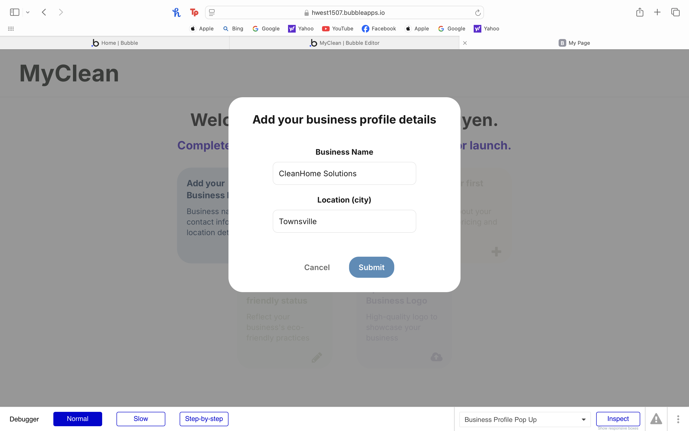  
Next they must add cleaners to the company, which registers the cleaner as a new user.  
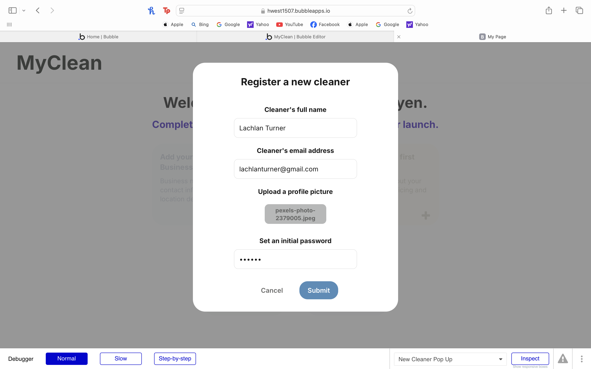  
After that the admin can add a new service to the company. The new price of the service
must be filled out as well.
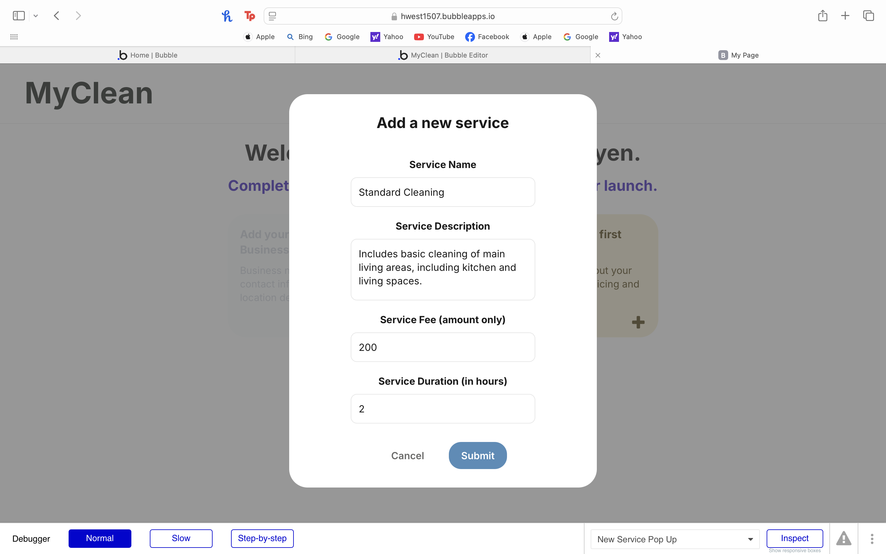
The admin can also select the eco-friendly option if their company is eco-friendly.
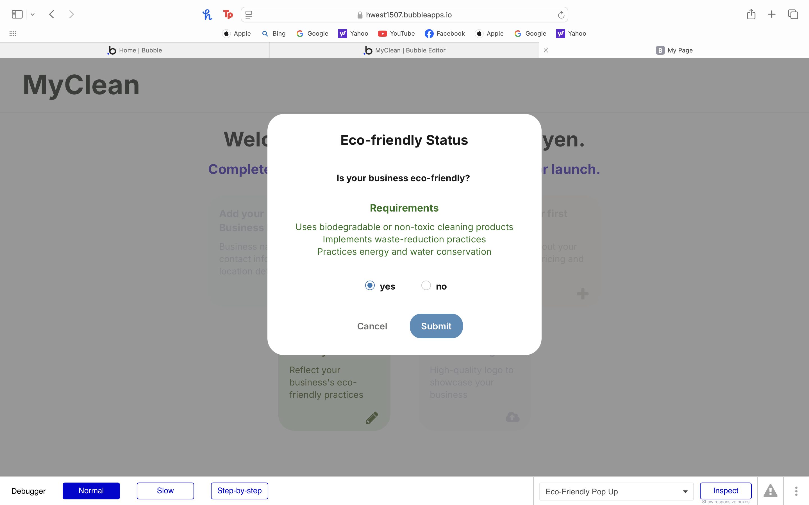
The logo is then added by the admin.
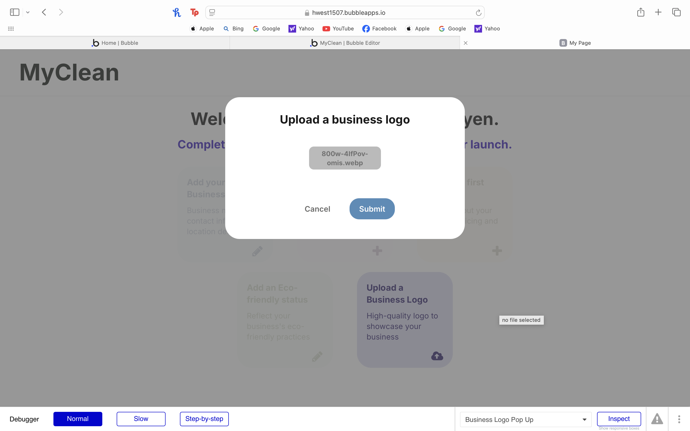
After adding all the information about the cleaning company, the service has been successfully
registered. Users can now find the service provider when searching for a cleaning service.
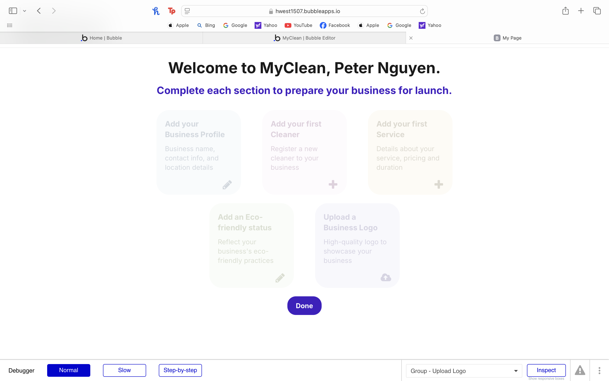
The admin can now access the admin dashboard which shows them their current cleaners
and services. Here they can also add new cleaners and services or edit business details.
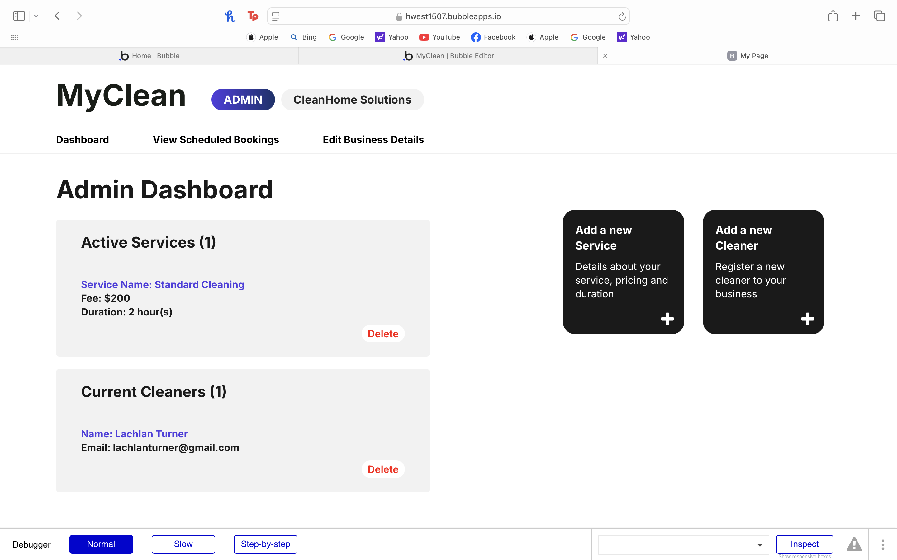
The admin can add a new service, fill out the details of the new service and then confirm
to see a new active service be added to the company.
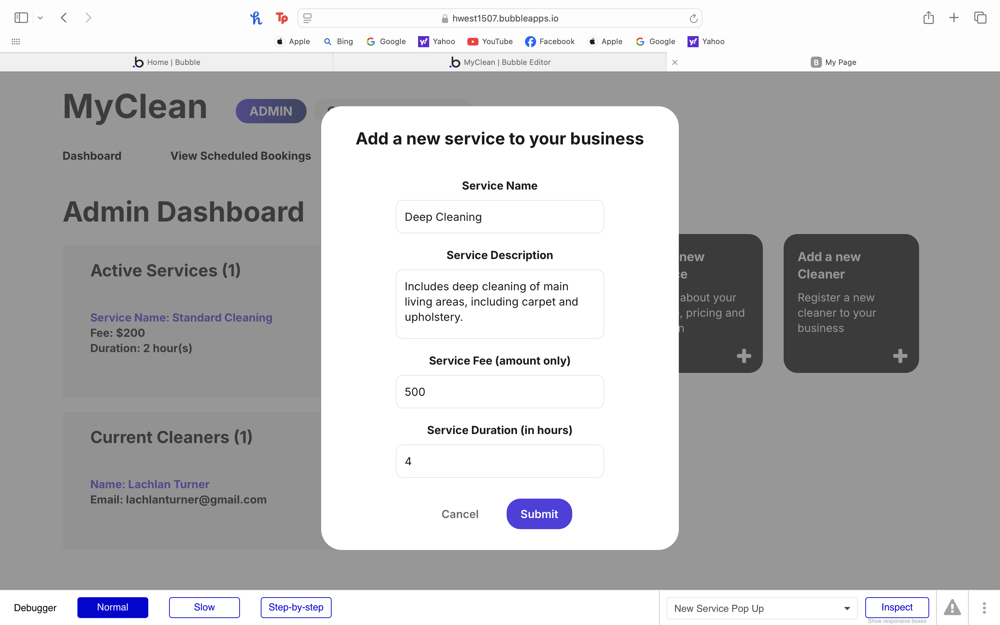
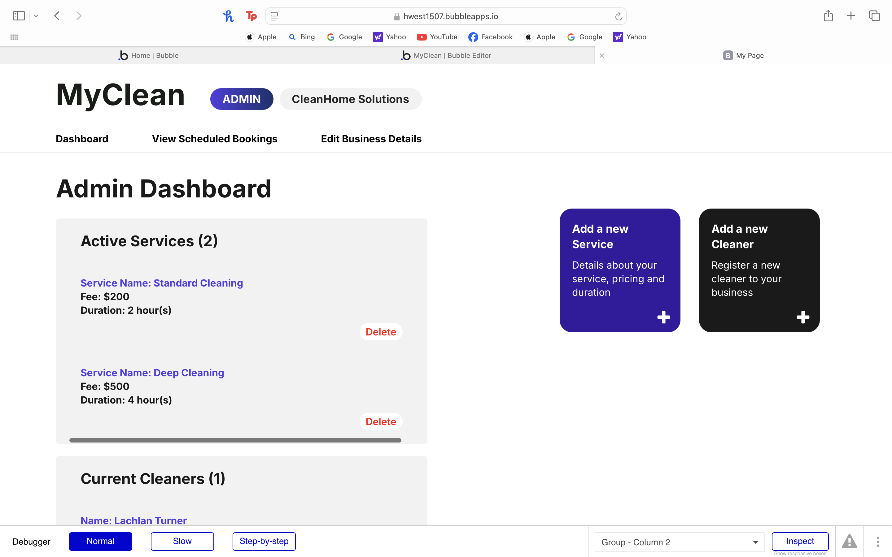
